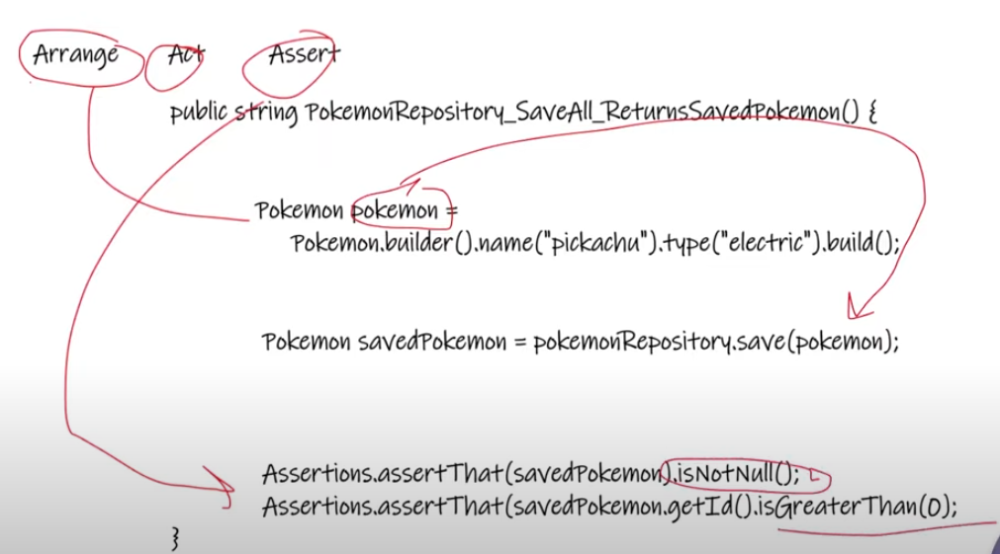
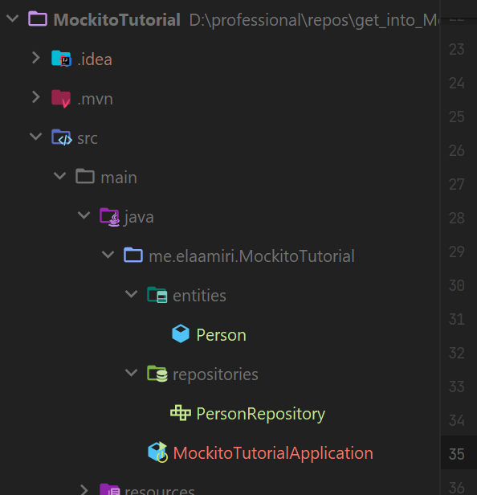
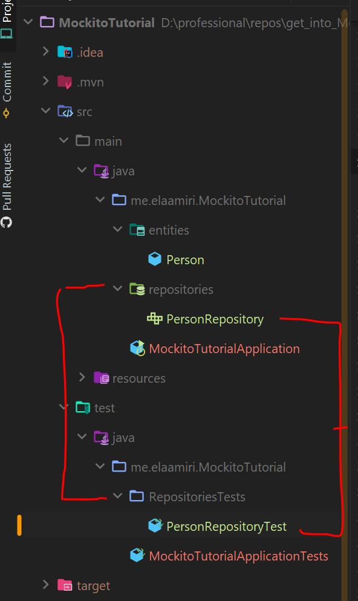
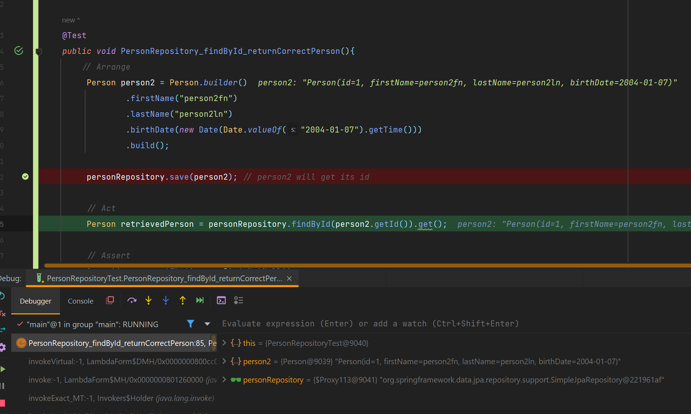
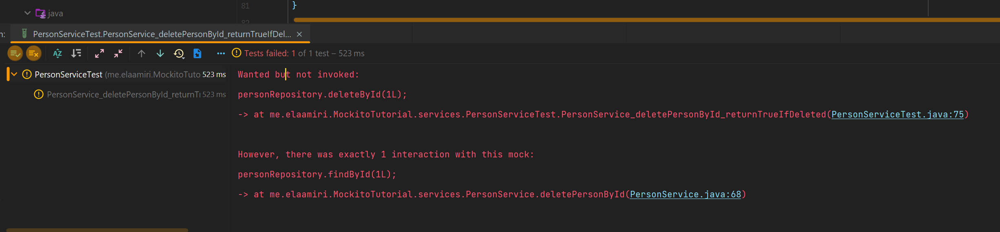
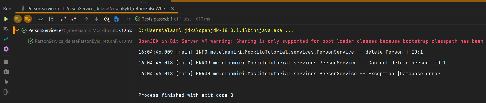

# getIntoMockitoForUnitTesting
This repository is a small light weight reference to get into Mockito framework with JUnit for unit testing.
## Intoduction 
### Prerequirements
- This tutorial is for purpose to discover how Mockito and JUint work, and how we use them to do our unit testing in a Spring Boot application.
- In this tutorial we will be using Java, Spring Boot, JUnit4 and Mockito.
- Before starting this tutorial make sure you have some experience in Java, Spring Boot and JUnit4.
- [Here you can find a JUnit basics tutorial :link:](https://github.com/essadeq-elaamiri/get_into_junit)
#### Why unit testing? 
- Make sure at least 70% of your code has unit testing.
- `Clear for take off`: Do not push your code to repository without running the unit tests and correct possible errors.
- Prevents Bugs.
- Helps you think about your code.
- Fun

#### What is Unit Testing 

#### What is a unit of source code
A unit of source code is the smallest part of a code that can be tested. In Java languages, this is usually a method or a class.

#### What is unit testing
- Unit testing is the process through which units of source code are tested to verify if they work properly. 
- Performing unit tests is a way to ensure that all functionalities of an application are working as they should. 
- Unit tests inform the developer when a change in one unit interferes with the functionality of another. 
- Modern unit testing frameworks are typically implemented using the same code used by the system under test. 
- This enables a developer who is writing application code in Java to write their unit tests in Java as well.

#### What is mocking
- Mocking is a process used in unit testing when the unit being tested has external dependencies. 
- The **purpose of mocking** is __to isolate and focus on the code being tested and not on the behavior or state of external dependencies__. 
- In `mocking`, the dependencies are replaced by closely controlled replacements objects that simulate the behavior of the real ones. 
- There are three main possible types of replacement objects - `fakes`, `stubs` and `mocks`.

**`Fakes`**: 
- A Fake is an object that will replace the actual code by implementing the same interface but without interacting with other objects. 
- Usually the Fake is hard-coded to return fixed results. 
- To test for different use cases, a lot of Fakes must be introduced. 
- The problem :x: introduced by using Fakes is that when an interface has been modified, all fakes implementing this interface should be modified as well.

**`Stubs`**: 
- A Stub is an object that will return a specific result based on a specific set of inputs and usually won’t respond to anything outside of what is programed for the test. 


**`Mocks`**: 
- A Mock is a much more sophisticated version of a Stub. It will still return values like a Stub, but it can also be programmed with expectations in terms of how many times each method should be called, in which order and with what data. 

- More info [here](https://www.telerik.com/products/mocking/unit-testing.aspx#:~:text=The%20purpose%20of%20mocking%20is,behavior%20of%20the%20real%20ones.) and [here](https://www.j-labs.pl/en/tech-blog/mocks-stubs-and-spies-in-unit-testing-based-on-mockito/#:~:text=A%20stub%20is%20an%20object,output%2C%20independently%20from%20the%20input.).


#### Triple A (AAA) 
- Called also (BDD): Behaviour Driven Development.
- **AAA**: Arrange, Act, Assert: A common pattern for writing tests where you set up the test data, perform the action, and then verify the results.
1. **Arrange**: Prepare instances
2. **Act**: Do the action to be tested
3. **Assert**: Test the results 



#### Testing our project 

- In our case we will cover unit testing in 3 layers:
    * Repository layer 
    * Service layer 
    * Controller layer 

##### Test the Repository

- As contxt We have the entity Person and it's Repository PersonRepository and we want to test it.



- Here the code.
Person.java
```java
@Entity
@AllArgsConstructor
@NoArgsConstructor
@Builder
@Data
public class Person {

    @GeneratedValue(strategy = GenerationType.IDENTITY)
    @Id
    Long id;
    String firstName;
    String lastName;
    @Temporal(TemporalType.DATE)
    Date birthDate;
}
```
PersonRepository.java
```java
@Repository
public interface PersonRepository extends JpaRepository<Person, Long> {
}

```
- __Lets test this Repository__
- The first step is to **Add the needed dependencies :**
pom.xml
```xml
<dependencies>
		<dependency>
			<groupId>org.springframework.boot</groupId>
			<artifactId>spring-boot-starter-data-jpa</artifactId>
		</dependency>
		<dependency>
			<groupId>com.h2database</groupId>
			<artifactId>h2</artifactId>
			<scope>test</scope>
		</dependency>
		<dependency>
			<groupId>org.projectlombok</groupId>
			<artifactId>lombok</artifactId>
			<optional>true</optional>
		</dependency>
		<dependency>
			<groupId>org.springframework.boot</groupId>
			<artifactId>spring-boot-starter-test</artifactId>
			<scope>test</scope>
		</dependency>
		<!-- https://mvnrepository.com/artifact/junit/junit -->
		<dependency>
			<groupId>junit</groupId>
			<artifactId>junit</artifactId>
			<version>4.13.2</version>
			<scope>test</scope>
		</dependency>

	</dependencies>
```
- As shown we set the scope test for `h2`, `spring-boot-starter-test` and `junit` dependencies.
- H2 is used only for testing Here.
- We test here the repository so we are using only `spring-boot-starter-data-jpa`.
- **Create testing packages**
- Now we should create the testing class for the Repository, we will name it `PersonRepositoryTest`.
- The test class should be in the same packaging level of the tested class related to it (PersonRepository) in our case.



- Here is the code of our test class `PersonRepositoryTest`.

```java
@DataJpaTest
@AutoConfigureTestDatabase(connection = EmbeddedDatabaseConnection.H2)
@RunWith(SpringRunner.class) // Resolved the issue of NullPointerException in personRepository
public class PersonRepositoryTest {
    @Autowired
    private PersonRepository personRepository;

    @Test
    public void PersonRepository_saveAll_returnSavedPerson(){
        // Arrange
        Person person = Person.builder()
                .firstName("Essadeq")
                .lastName("EL AAMIRI")
                .birthDate(new Date(Date.valueOf("1999-01-07").getTime()))
                .build();

        // Act
        Person savedPerson = personRepository.save(person);

        // Assert
        Assertions.assertThat(savedPerson).isNotNull();
        Assertions.assertThat(savedPerson.getId()).isPositive();
        Assertions.assertThat(savedPerson.getFirstName()).isEqualTo(person.getFirstName());

    }

}
```
- Let's explain all of this:

`@DataJpaTest`:
- This annotation is used to test JPA repositories.
- It configures an in-memory database (like H2), scans for @Entity classes, and configures Spring Data JPA repositories.
- It also disables full auto-configuration and instead applies only configuration relevant to JPA tests.

- By default, each test method annotated with `@DataJpaTest` runs within a transactional boundary. 
- This ensures that changes made to the database are automatically rolled back at the end of the test, leaving a clean slate for the next test.

<details>
<summary>More about @DataJpaTest </summary>

- https://www.baeldung.com/junit-datajpatest-repository 

> The @DataJpaTest annotation is used to test JPA repositories in Spring Boot applications. It’s a specialized test annotation that provides a minimal Spring context for testing the persistence layer. This annotation can be used in conjunction with other testing annotations like @RunWith and @SpringBootTest.

> In addition, the scope of @DataJpaTest is limited to the JPA repository layer of the application. It doesn’t load the entire application context, which can make testing faster and more focused. This annotation also provides a pre-configured EntityManager and TestEntityManager for testing JPA entities.

</details>


`@AutoConfigureTestDatabase(connection = EmbeddedDatabaseConnection.H2)`:
- This annotation specifies that the test should use an embedded H2 database.
- H2 is an in-memory database that is often used for testing because it is lightweight and fast.

`@RunWith(SpringRunner.class)`:
- This annotation tells JUnit to run the test with Spring's testing support.
- `SpringRunner` is an alias for `SpringJUnit4ClassRunner`, which integrates the Spring TestContext Framework with JUnit 4.
- In my case this is necessary to autowire Spring components (like PersonRepository) into the test class.
- `@RunWith(SpringRunner.class)` is necessary in JUnit 4 to initialize the Spring context and enable dependency injection.
- Without it, the Spring context is not loaded, and @Autowired dependencies remain null.

<details>
<summary>More about `@RunWith(SpringRunner.class)`</summary>

- https://stackoverflow.com/questions/58901288/springrunner-vs-springboottest 

`@RunWith(SpringRunner.class)` : You need this annotation to just enable spring boot features like @Autowire, @MockBean etc.. during junit testing

> is used to provide a bridge between Spring Boot test features and JUnit. Whenever we are using any Spring Boot testing features in our JUnit tests, this annotation will be required.

</details>

- So we injected the repository and satrt testing by the method `PersonRepository_saveAll_returnSavedPerson` which aims to test the save to database.


- `@Test`
This annotation marks the method as a test case that JUnit will run.

- **Arrange**: Prepare test data
- Here, we create a `Person` object using a builder pattern.
- The `Person` object is initialized with a first name, last name, and birth date.

- **Act**: Perform the action we want to test
- We call the `save` method on the `personRepository` to save the `Person` object to the database.
- The `save` method returns the saved `Person` object, which includes any auto-generated fields (like an ID).

- **Assert**: Verify the action result == test it
- We use assertions to verify that the `save` operation worked correctly:
- `assertThat(savedPerson).isNotNull();`: Checks that the saved `Person` object is not null.
- `assertThat(savedPerson.getId()).isPositive();`: Checks that the ID of the saved `Person` is a positive number (indicating that it was successfully generated by the database).
- `assertThat(savedPerson.getFirstName()).isEqualTo(person.getFirstName());`: Checks that the first name of the saved `Person` matches the first name we set initially.

- **Unit Tests naming conventions & best practices**:
> 1. The test name should describe what we want to test.For exmaple we used `PersonRepository_saveAll_returnSavedPerson` for our method, to indicate that we are testing the save method of the repo. respecting [Roy Osherove's naming strategy](https://osherove.com/blog/2005/4/3/naming-standards-for-unit-tests.html):
> **` [UnitOfWork_StateUnderTest_ExpectedBehavior]`** 
> For the classes, it's convenient to use the name of the tested class with `Test` or `Tests` as sufix (use the same for all test classes).

- So we just did out first unit test, lets continues.
- Let's new test `findAll` method of the repository: here is the code.

```java
@Test
    public void PersonRepository_findAll_returnMoreThanOnePerson(){
        // Arrange // prepare test data
        Person person1 = Person.builder()
                .firstName("person1fn")
                .lastName("person1ln")
                .birthDate(new Date(Date.valueOf("1999-01-07").getTime()))
                .build();
        Person person2 = Person.builder()
                .firstName("person2fn")
                .lastName("person2ln")
                .birthDate(new Date(Date.valueOf("2004-01-07").getTime()))
                .build();

        personRepository.saveAll(Lists.list(person1, person2));
        // Act // Perform test action

        List<Person> personList = personRepository.findAll();

        // Assert
        //Assertions.assertThat(personList).isNotNull();
        //Assertions.assertThat(personList).hasSize(2);
        // We can use them in one chain
        Assertions.assertThat(personList).isNotNull().hasSize(2);

    }
```
- All clear nothing needs to be explained.
- `Assertions` is a part of `Assertj`.
- Link: https://assertj.github.io/doc/#assertj-core 
- Here is an other example with a funny fact :smile:

```java
@Test
public void PersonRepository_findById_returnCorrectPerson(){
    // Arrange
        Person person2 = Person.builder()
                .firstName("person2fn")
                .lastName("person2ln")
                .birthDate(new Date(Date.valueOf("2004-01-07").getTime()))
                .build();

        personRepository.save(person2); // person2 will get its id

        // Act
        Person retrievedPerson = personRepository.findById(person2.getId()).get();

        // Assert
        Assertions.assertThat(person2).isNotNull()
                                        .isEqualTo(retrievedPerson);
}
```
- The Funny fact :fire::fire: 
> The `save()` method of the JpaRepository modifies the actual object passed to it (person2) by updating its id field with the value generated by the database.

- In our case after `personRepository.save(person2)` is called:
- The `id` field of `person2` is updated with the newly generated ID. that's why we used it directly in the Assertion without the need to affect the result of `save()` to a new Object.



- Let's test a **Custom Query Method**
- Here our custom Query Method in the Repository `PersonRepository`.

```java
@Repository
public interface PersonRepository extends JpaRepository<Person, Long> {
    Optional<Person> getPersonByFirstNameContaining(String fnKeyword);
}
```

- Here is the test in `PersonRepositoryTest`

```java
@Test
public void PersonRepository_getPersonByFirstNameContaining_returnListPersonWithFirstNameContainingKeyword(){
    // Arrange // prepare test data
    Person person1 = Person.builder()
            .firstName("person1fn")
            .lastName("person1ln")
            .birthDate(new Date(Date.valueOf("1999-01-07").getTime()))
            .build();
    Person person2 = Person.builder()
            .firstName("person2fn")
            .lastName("person2ln")
            .birthDate(new Date(Date.valueOf("2004-01-07").getTime()))
            .build();

    Person person3 = Person.builder()
            .firstName("differentFirstName")
            .lastName("person2ln")
            .birthDate(new Date(Date.valueOf("2004-01-07").getTime()))
            .build();

    personRepository.saveAll(Lists.list(person1, person2, person3));
    // Act // Perform test action

    List<Person> personList = personRepository.getPersonsByFirstNameContaining("per");

    // Assert
    Assertions.assertThat(personList).isNotNull().hasSize(2);
}
```
- The test is clear, simple and passed :ok:
- Visit code to see update and delete testing ... [link to PersonRepositoryTest.java](https://github.com/essadeq-elaamiri/getIntoMockitoForUnitTesting/blob/main/MockitoTutorial/src/test/java/me/elaamiri/MockitoTutorial/repositories/PersonRepositoryTest.java)


##### Test the Service layer using Mockito
- Before that let's talk about `mocking`.

In the context of unit testing, **mocking** refers to the practice of creating simulated or "fake" objects that mimic the behavior of real objects in a controlled way. These simulated objects are called **mocks**. 

Mocking is used to isolate the unit of code being tested and ensure that the test focuses solely on the logic of that unit, without relying on or being affected by external dependencies (like databases, APIs, or other classes).

**Why is Mocking Used?**

1. **Isolation**
- Unit tests are meant to test a single unit of code (e.g., a method or class) in isolation.
- Mocking allows you to replace external dependencies (e.g., databases, web services, or other classes) with mock objects, so the test doesn't rely on those dependencies.

2. **Control**
- Mock objects allow you to define specific behaviors or responses for methods, making it easier to test different scenarios (e.g., success, failure, edge cases).

3. **Speed**
- Mocking avoids the overhead of interacting with real dependencies (e.g., making network calls or querying a database), making tests faster.

4. **Simplicity**
- Mocking simplifies tests by removing the need to set up complex environments or dependencies.


**Key Concepts in Mocking**

1. **Mock Object**
- A simulated object that mimics the behavior of a real object.
- For example, if you're testing a service that interacts with a database, you can mock the database repository to return predefined data instead of querying a real database.

2. **Stub**
- A type of mock object that provides predefined responses to method calls.
- For example, you can stub a method to always return a specific value or throw an exception.

3. **Spy**
- A partial mock that wraps a real object and allows you to verify interactions with it while still using its real behavior for some methods.

4. **Verification**
- Mocking frameworks often allow you to verify that specific methods were called with the expected arguments during the test.

- Confused! Let's practice this shit haha :smile:
- Let's use Mockito to test the Service layer, here is the code, and we will explain it all...
- But before here are the Entity, the Dto and the Service as a reference.

<details>
<summary>
__Person.java, PersonDTO.java, PersonService.java__
</summary>

- Person.java

```java
@Entity
@AllArgsConstructor
@NoArgsConstructor
@Builder
@Data
public class Person {
    @GeneratedValue(strategy = GenerationType.IDENTITY)
    @Id
    Long id;
    String firstName;
    String lastName;
    @Temporal(TemporalType.DATE)
    Date birthDate;
    @Temporal(TemporalType.DATE)
    Date creationDate;
    @Temporal(TemporalType.DATE)
    Date lastModificationDate;
}
```

- PersonDTO.java
```java 
@Data @Builder
public class PersonDto {
    Long id;
    String firstName;
    String lastName;
    Date birthDate;
    Date creationDate;

}
```

- PersonService.java
```java 
@Service
@AllArgsConstructor @NoArgsConstructor
@Slf4j
public class PersonService {
    PersonRepository personRepository;

    public Optional<Person> getPersonById(long id){
        log.info("Get Person By Id | {}", id);
        return personRepository.findById(id);
    }

    public List<Person> getAllPersons(){
        log.info("Get All Persons ");
        return personRepository.findAll();
    }

    public Person createPerson(PersonDto person){
        log.info("create Person | {}", person.getFirstName());
        Person personToCreate= Person.builder().firstName(person.getFirstName())
                .lastName(person.getLastName())
                .birthDate(person.getBirthDate())
                .creationDate(new Date())
                .lastModificationDate(new Date()).build();
        return personRepository.save(personToCreate);
    }

    public Person updatePerson(PersonDto person){
        log.info("update Person | {}", person.getFirstName());
        if(Objects.isNull(person.getId())){
            log.error("You are trying to edit a person with no id. Name:{}", person.getFirstName());
            return null;
        }
        Person retrieved = personRepository.findById(person.getId()).orElse(null);
        if(Objects.isNull(retrieved)){
            log.error("No person with this id. ID:{}", person.getId());
            return null;
        }

        retrieved.setFirstName(person.getFirstName());
        retrieved.setLastName(person.getLastName());
        retrieved.setBirthDate(person.getBirthDate());
        retrieved.setCreationDate(person.getCreationDate());
        retrieved.setLastModificationDate(new Date());

        return personRepository.save(retrieved);
    }

    public boolean deletePersonById(long id){
        log.info("delete Person | ID:{}", id);
        Person retrieved = personRepository.findById(id).orElse(null);
        if(Objects.isNull(retrieved)){
            log.error("No person with this id. ID:{}", id);
            return false;
        }
        personRepository.deleteById(id);
        return true;
    }
}
```

</details>

- PersonServiceTest.java
```java 
//@ExtendWith(MockitoExtension.class)
@RunWith(MockitoJUnitRunner.class) // Resolved NullPointerException In @Mock objects
public class PersonServiceTest {

    @Mock
    private PersonRepository personRepository;  // I dont want the real behavior of the repo, so I mock it

    @InjectMocks // Assuming PersonService uses PersonRepository
    private PersonService personService;

    @Test
    public void PersonService_createPerson_returnPerson(){
        Person person1 = Person.builder().firstName("salima").lastName("Gau").birthDate(new Date(Date.valueOf("1999-01-07").getTime())).build();
        PersonDto personDto = PersonDto.builder().firstName("salima").lastName("Gau").birthDate(new Date(Date.valueOf("1999-01-07").getTime())).build();
        // Apply mock: telling to Mockito, when personRepository.save() call on any Person object, return the specific object
        // So we mock the real behavior of the repo by this
        Mockito.when(personRepository.save(Mockito.any(Person.class))).thenReturn(person1);
        // Now we will test the service without touching the real behavior of the Repository
        Person created = personService.createPerson(personDto);

        Assertions.assertThat(created).isNotNull();
        Assertions.assertThat(created.getFirstName()).isEqualTo(person1.getFirstName());

    }

    @Test
    public void PersonService_getPersonById_returnPerson(){
        Person person1 = Person.builder().id(550L).firstName("salima").lastName("Gau").birthDate(new Date(Date.valueOf("1999-01-07").getTime())).build();
        PersonDto personDto = PersonDto.builder().id(550L).firstName("salima").lastName("Gau").birthDate(new Date(Date.valueOf("1999-01-07").getTime())).build();
        Mockito.when(personRepository.save(Mockito.any(Person.class))).thenReturn(person1);
        Person saved = personService.createPerson(personDto);
        Mockito.when(personRepository.findById(person1.getId())).thenReturn(Optional.of(person1));
        Person retrieved = personService.getPersonById(person1.getId()).get();
        Assertions.assertThat(retrieved).isNotNull().isEqualTo(person1);
        
    }

    @Test
    public void PersonService_getPersonById_2_returnPerson(){
       // Alternative approach: Mock the Person object directly instead of using a real Person object.
        Person personMock = Mockito.mock(Person.class); //Create a mocked Person object to simulate its behavior.
        System.out.println(personMock);
        Mockito.when(personRepository.findById(personMock.getId())).thenReturn(Optional.of(personMock));
        Person retrievedPerson = personService.getPersonById(personMock.getId()).get();
        Assertions.assertThat(retrievedPerson).isNotNull().isEqualTo(personMock);
        // So we tested the service getPersonById method without problems with the repo
    }
}
```
- **Explanation of the Code**

This code is a unit test class for a `PersonService` using **Mockito** and **JUnit**. The purpose of this test is to verify the behavior of the `PersonService` methods without relying on the actual implementation of the `PersonRepository`. Instead, the repository is mocked to simulate its behavior.

- Key Annotations and Their Purpose

1. **`@RunWith(MockitoJUnitRunner.class)`**  
   This annotation tells JUnit to run the test with the `MockitoJUnitRunner`, which initializes mocks and handles dependency injection.  
   - **Note**: You have both `@ExtendWith(MockitoExtension.class)` (for JUnit 5) and `@RunWith(MockitoJUnitRunner.class)` (for JUnit 4) in the code. These are for different versions of JUnit. You should use only one depending on your JUnit version:
     - Use `@ExtendWith(MockitoExtension.class)` for JUnit 5.
     - Use `@RunWith(MockitoJUnitRunner.class)` for JUnit 4.

2. **`@Mock`**  
   This annotation creates a mock instance of `PersonRepository`. Mocks are used to simulate the behavior of dependencies without invoking their actual implementation.

3. **`@InjectMocks`**  
   This annotation injects the mocked `PersonRepository` into the `PersonService` instance. It assumes that `PersonService` has a dependency on `PersonRepository`.

-  Test Methods

1. **`PersonService_createPerson_returnPerson`**
   - **Purpose**: Tests the `createPerson` method of `PersonService`.
   - **Steps**:
     1. Creates a `Person` and `PersonDto` object with sample data.
     2. Mocks the `save` method of `PersonRepository` to return the `Person` object when called.
     3. Calls the `createPerson` method of `PersonService` and verifies that the returned `Person` object is not null and matches the expected data.

2. **`PersonService_getPersonById_returnPerson`**
   - **Purpose**: Tests the `getPersonById` method of `PersonService`.
   - **Steps**:
     1. Creates a `Person` object with sample data.
     2. Mocks the `save` method of `PersonRepository` to return the `Person` object when called. 
     3. Mocks the `findById` method of `PersonRepository` to return the `Person` object when called with the specific ID.
     4. Calls the `getPersonById` method of `PersonService` and verifies that the returned `Person` object matches the expected data.
     5. Demonstrates an alternative approach using a mocked `Person` object instead of creating a real one.

3. **`PersonService_getPersonById_2_returnPerson`**
   - **Purpose**: Tests the `getPersonById` method of `PersonService` using a mocked `Person` object.
   - **Steps**:
     1. Creates a mocked `Person` object.
     2. Mocks the `findById` method of `PersonRepository` to return the mocked `Person` object when called with the specific ID.
     3. Calls the `getPersonById` method of `PersonService` and verifies that the returned `Person` object matches the mocked object.

###### More Mocking Scenarios and Examples
1. **Mocking Void Methods**
- Void methods don’t return a value, but you can still mock their behavior using `doNothing()`, `doThrow()`, or `doAnswer()`.

```java 
@Test
    public void PersonService_deletePersonById_returnTrueIfDeleted(){
        // Mock the delete method to do nothing
        Mockito.doNothing().when(personRepository).deleteById(Mockito.anyLong());
        // Call the method under test
        boolean deleted = personService.deletePersonById(1L);
        // Verify the method was called 1 time
        Mockito.verify(personRepository, Mockito.times(1)).deleteById(1L);
        // Verify the return is true
        Assertions.assertThat(deleted).isTrue();
    }
```
- Watch the result the test Failed :x:



- It says wanted but not called, but why ? :smile: It's because of this condition in the service method : 

```java
public boolean deletePersonById(long id){
    log.info("delete Person | ID:{}", id);
    Person retrieved = personRepository.findById(id).orElse(null);
    if(Objects.isNull(retrieved)){
        log.error("No person with this id. ID:{}", id);
        return false;
    }
    personRepository.deleteById(id);
    return true;
}
```
- The passed id does not return a Person, so we need to mock `personRepository.findById` also.
- Here is the new test 

```java
@Test
public void PersonService_deletePersonById_returnTrueIfDeleted(){
    Person personMock = Mockito.mock(Person.class);

    Mockito.doReturn(Optional.of(personMock)).when(personRepository).findById(1L);
    // Mock the delete method to do nothing
    Mockito.doNothing().when(personRepository).deleteById(Mockito.anyLong());
    // Call the method under test
    boolean deleted = personService.deletePersonById(1L);
    // Verify the method was called 1 time
    Mockito.verify(personRepository, Mockito.times(1)).deleteById(1L);
    // Verify the return is true
    Assertions.assertThat(deleted).isTrue();
}
```
- Now tests passes :v:
- We mocked the `personRepository.findById` to return the optional of the mocked Person object.

2. **Mocking Methods with Exceptions**
- We can simulate exceptions to test error handling in your code.
- Let's for example simulate that `personRepository.deleteById()` returns an exception when updating a Person via `personService.deletePersonById()`.

```java
@Test
public void PersonService_deletePersonById_deleteByIdThrowsException(){
    Person personMock = Mockito.mock(Person.class);

    Mockito.doReturn(Optional.of(personMock)).when(personRepository).findById(1L);
    // Mock the findById method to throw an exception
    //Mockito.when(personRepository.deleteById(1L)).thenThrow(new RuntimeException("Database error")); // Does not work because deleteById return nothing its void
    Mockito.doThrow(new RuntimeException("Database error")).when(personRepository).deleteById(1L);
    // Verify that the exception is thrown
    Assertions.assertThatThrownBy(()-> personService.deletePersonById(1L))
                    .isInstanceOf(RuntimeException.class)
                    .hasMessage("Database error");
    
}
```
- Other exmple here to exception handling in `personService.deletePersonById()`.
- We will mock the findById method to throw an exception, and verify that the service deletePersonById returns false.

```java 
@Test
    public void PersonService_deletePersonById_returnFalseWhenFindByIdThrowsException(){
    Person personMock = Mockito.mock(Person.class);
    Mockito.doReturn(Optional.of(personMock)).when(personRepository).findById(1L);
    // Mock the findById method to throw an exception
    //Mockito.when(personRepository.deleteById(1L)).thenThrow(new RuntimeException("Database error")); // Does not work because deleteById return nothing its void
    Mockito.doThrow(new RuntimeException("Database error")).when(personRepository).deleteById(1L);
    // Verify
    Assertions.assertThat(personService.deletePersonById(1L)).isFalse();
}
```
- Here our `personService.deletePersonById()`, without handling:
```java 
public boolean deletePersonById(long id){
    log.info("delete Person | ID:{}", id);
    Person retrieved = personRepository.findById(id).orElse(null);
    if(Objects.isNull(retrieved)){
        log.error("No person with this id. ID:{}", id);
        return false;
    }
    personRepository.deleteById(id);
    return true;
}
```
- And test result Failed :x: as expected.

- Here our `personService.deletePersonById()`, after Excetion handling:
```java 
public boolean deletePersonById(long id){
    log.info("delete Person | ID:{}", id);
    Person retrieved = personRepository.findById(id).orElse(null);
    if(Objects.isNull(retrieved)){
        log.error("No person with this id. ID:{}", id);
        return false;
    }
    try{personRepository.deleteById(id);}
    catch (Exception exception){
        log.error("Can not delete person. ID:{}", id);
        log.error("Exception |{}", exception.getMessage());
        return false;
    }
    return true;
}
```
- And here are the shining green lights :chart:


##### Test the Controllers or Web Layer using Mockito
- Now lets use Mockito to test our controller's methods `PersonController.java`.
- To do that we will use **`MockMvc`**.
-`MockMvc` is a mocked servlet environment that we can use to test our HTTP controller endpoints without the need to launch our embedded servlet container. 
- While `MockMvc` is a mocked environment, it still comes with HTTP semantics so that we can test the serialization, HTTP status codes, and return types of our endpoints.
- More inf [here:link:](https://codingnomads.com/java-spring-mockmvc)
- We should add Spring web dependency first :

```xml 
<dependency>
    <groupId>org.springframework.boot</groupId>
    <artifactId>spring-boot-starter-web</artifactId>
</dependency>
```

- Now let's test, here is our controller:
- PersonController.java
```java

@RestController
@RequestMapping("api/persons")
@AllArgsConstructor
@NoArgsConstructor
public class PersonController {
    private PersonService personService;

    @GetMapping("/")
    public List<Person> getAllPersons(){
        return personService.getAllPersons();
    }

    @GetMapping("/{id}")
    public ResponseEntity<Person> getPerson(@PathVariable Long id){
        return ResponseEntity.ok(personService.getPersonById(id).orElse(null));
    }

    @PostMapping("/")
    //@ResponseStatus(HttpStatus.CREATED)
    /*
    @ResponseStatus is Typically Used for Void Methods:
    It is most useful when a method does not return a ResponseEntity
     */
    public ResponseEntity<Person> createPerson(@RequestBody PersonDto personDto){
        return new ResponseEntity<>(personService.createPerson(personDto), HttpStatus.CREATED);
    }

    @PutMapping("/")
    public ResponseEntity<Person> updatePerson(@RequestBody PersonDto personDto){
        return new ResponseEntity<>(personService.updatePerson(personDto), HttpStatus.OK);
    }

    @DeleteMapping("/{id}")
    public ResponseEntity<Boolean> deletePerson(@PathVariable Long id){
        return new ResponseEntity<>(personService.deletePersonById(id), HttpStatus.OK);
    }
}
```
- Here our test class, let's explain it one by one.
- PersonControllerTest.java 
```java 

@RunWith(MockitoJUnitRunner.class)
public class PersonControllerTest {

    private MockMvc mockMvc; // Used to simulate HTTP requests
    @Mock
    private PersonService personService;
    @InjectMocks
    private PersonController personController;

    private Person person1;
    private PersonDto personDto;

    private static final String API_BASE_URL = "/api/persons";

    @Before
    public void setup(){
        // Initialize MockMvc with the controller
        mockMvc = MockMvcBuilders.standaloneSetup(personController).build();

        person1 = Person.builder().firstName("salima").lastName("Gau").birthDate(new Date(Date.valueOf("1999-01-07").getTime())).build();
        personDto = PersonDto.builder().firstName("salima").lastName("Gau").birthDate(new Date(Date.valueOf("1999-01-07").getTime())).build();
    }

    @Test
    public void PersonController_getAllPersons_returnNotEmptyList() throws Exception{
        // Mock the service Behavior
        Mockito.when(personService.getAllPersons()).thenReturn(Lists.list(person1));
        // Act & Assert
        mockMvc.perform(MockMvcRequestBuilders.get(API_BASE_URL+"/"))
                .andExpect(MockMvcResultMatchers.status().isOk())
                .andExpect(MockMvcResultMatchers.jsonPath("$", Matchers.hasSize(1)))
                .andExpect(MockMvcResultMatchers.jsonPath("$[0].firstName").value(person1.getFirstName()));
    }

    @Test
    public void PersonController_getPerson_returnPerson() throws Exception{
        // Arrange
        Long id = 1L;
        // Mock the service Behavior
        Mockito.when(personService.getPersonById(Mockito.anyLong())).thenReturn(Optional.ofNullable(person1));

        mockMvc.perform(MockMvcRequestBuilders.get(API_BASE_URL+"/"+id))
                .andExpect(MockMvcResultMatchers.status().isOk())
                .andExpect(MockMvcResultMatchers.jsonPath("$.firstName").value(person1.getFirstName()))
                .andExpect(MockMvcResultMatchers.jsonPath("$.lastName").value("gh"));

        // Test Failed
        /*
        Result output :
        java.lang.AssertionError: JSON path "$.lastName"
        Expected :gh
        Actual   :Gau
         */
    }

    @Test
    public void PersonController_createPerson_returnPerson() throws Exception{
        // Mock the service Behavior
        Mockito.when(personService.createPerson(Mockito.any(PersonDto.class))).thenReturn(person1);

        mockMvc.perform(MockMvcRequestBuilders.post(API_BASE_URL+"/")
                        .contentType(MediaType.APPLICATION_JSON)
                        .content((new ObjectMapper()).writeValueAsString(person1))) 
                .andExpect(MockMvcResultMatchers.status().isCreated())
                .andExpect(MockMvcResultMatchers.jsonPath("$.firstName").value(person1.getFirstName()));
    }
}
```

- **Step-by-Step Explanation**
1. __Test Class Setup__
`@RunWith(MockitoJUnitRunner.class)`:
- This tells JUnit to run the test with the `MockitoJUnitRunner`, which initializes mocks and handles dependency injection.

`@Mock`:
- Creates a mock instance of `PersonService`. This allows you to simulate the behavior of the service without using its real implementation.

`@InjectMocks`:
- Injects the mocked `PersonService` into the `PersonController` instance. This ensures that the controller uses the mock service during testing.

`MockMvc`:
A Spring testing framework that allows you to simulate HTTP requests and validate responses without the need to run the container/server.

2. __Setup Method__
`@Before public void setup()`:
- This method runs before each test. It initializes `MockMvc` with the `PersonController` instance using `MockMvcBuilders.standaloneSetup()`.

`standaloneSetup()`:
- Configures `MockMvc` to test the controller in isolation, without loading the entire Spring context.

3. __Test Method__
`@Test public void testGetAllPersons()`:
This is the actual test method for the `getAllPersons` endpoint.
* Arrange:
    - Create a list of Person objects to simulate the response from the service.
    - Use `Mockito.when(...).thenReturn(... `to mock the `getAllPersons` method of `PersonService` to return the list of persons.

* Act & Assert:
    - Use `mockMvc.perform()` to simulate a GET request to the `/api/persons/` endpoint.
    - Use `andExpect()` to validate the response:
        - Status Code: Verify that the response status is 200 OK.
        - JSON Path: Use jsonPath() to validate the structure and content of the JSON response.


- **MockMvcRequestBuilders: Simulating HTTP Requests**

`MockMvcRequestBuilders` provides methods to simulate different types of HTTP requests (GET, POST, PUT, DELETE, etc.). Below is a table of commonly used methods and their descriptions:

| Method                          | Description                                                                 |
|---------------------------------|-----------------------------------------------------------------------------|
| **`get(String url)`**           | Simulates a GET request to the specified URL.                               |
| **`post(String url)`**          | Simulates a POST request to the specified URL.                              |
| **`put(String url)`**           | Simulates a PUT request to the specified URL.                               |
| **`delete(String url)`**        | Simulates a DELETE request to the specified URL.                            |
| **`multipart(String url)`**     | Simulates a multipart request (e.g., file upload).                          |
| **`content(String content)`**   | Sets the request body (e.g., JSON payload).                                 |
| **`header(String name, String value)`** | Adds a header to the request.                                      |
| **`param(String name, String value)`** | Adds a query parameter to the request.                              |

- Example: Simulating a GET Request
```java
mockMvc.perform(MockMvcRequestBuilders.post("/api/persons/")
       .contentType(MediaType.APPLICATION_JSON)
       .content("{\"firstName\":\"John\",\"lastName\":\"Doe\"}"))
       .andExpect(MockMvcResultMatchers.status().isCreated());
```

- **MockMvcResultMatchers: Validating Responses**

`MockMvcResultMatchers` provides methods to validate the response. Here are some commonly used methods:

| Method                                      | Description                                                                 |
|---------------------------------------------|-----------------------------------------------------------------------------|
| **`status().isOk()`**                       | Verifies that the response status is `200 OK`.                              |
| **`status().isCreated()`**                  | Verifies that the response status is `201 Created`.                         |
| **`status().isNotFound()`**                 | Verifies that the response status is `404 Not Found`.                       |
| **`jsonPath("$.field").value(expected)`**   | Verifies the value of a JSON field in the response.                         |
| **`header().string("name", "value")`**      | Verifies the value of a response header.                                    |
| **`content().string("expected")`**          | Verifies the response body as a string.                                     |
| **`content().json("{\"field\":\"value\"}")`** | Verifies the response body as JSON.                                       |


- Example: Validating Status Code
```java
mockMvc.perform(MockMvcRequestBuilders.get("/api/persons/1"))
       .andExpect(MockMvcResultMatchers.status().isOk())
       .andExpect(MockMvcResultMatchers.jsonPath("$.firstName").value("John"))
       .andExpect(MockMvcResultMatchers.jsonPath("$.lastName").value("Doe"));
```

- **Other Possibilities and Advanced Features**
1. Testing Exception Handling
Simulate exceptions in the service layer and verify that the controller returns the correct error response.

```java
@Test
public void testGetPersonById_NotFound() throws Exception {
    Mockito.when(personService.getPersonById(1L)).thenThrow(new PersonNotFoundException("Person not found"));

    mockMvc.perform(MockMvcRequestBuilders.get("/api/persons/1"))
           .andExpect(MockMvcResultMatchers.status().isNotFound());
}
```

2. Testing File Uploads
Use `MockMvcRequestBuilders.multipart()` to simulate file uploads.

```java
@Test
public void testFileUpload() throws Exception {
    MockMultipartFile file = new MockMultipartFile("file", "test.txt", "text/plain", "Hello World".getBytes());

    mockMvc.perform(MockMvcRequestBuilders.multipart("/api/upload")
           .file(file))
           .andExpect(MockMvcResultMatchers.status().isOk());
}
```

3. Testing Security
Use `@WithMockUser` to simulate authenticated users.

```java
@Test
@WithMockUser(roles = "ADMIN")
public void testAdminEndpoint() throws Exception {
    mockMvc.perform(MockMvcRequestBuilders.get("/api/admin"))
           .andExpect(MockMvcResultMatchers.status().isOk());
}
```

4. Testing Request and Response Headers
You can test request and response headers to ensure your controller handles them correctly.

```java
@Test
public void testHeaders() throws Exception {
    mockMvc.perform(MockMvcRequestBuilders.get("/api/persons/1")
           .header("Authorization", "Bearer token")) // Add a request header
           .andExpect(MockMvcResultMatchers.status().isOk())
           .andExpect(MockMvcResultMatchers.header().string("Content-Type", "application/json")); // Verify response header
}
```

5. Testing Query Parameters
If your controller uses query parameters, you can simulate them in your tests.

```java
@Test
public void testQueryParameters() throws Exception {
    mockMvc.perform(MockMvcRequestBuilders.get("/api/persons")
           .param("firstName", "John") // Add query parameters
           .param("lastName", "Doe"))
           .andExpect(MockMvcResultMatchers.status().isOk());
}
```

6. Using Argument Captors
If you need to verify the arguments passed to a mocked method, you can use ArgumentCaptor.

```java
@Test
public void testCreatePerson_ArgumentCaptor() throws Exception {
    ArgumentCaptor<PersonDto> personDtoCaptor = ArgumentCaptor.forClass(PersonDto.class);
    Person person = new Person(1L, "John", "Doe", LocalDate.parse("1990-01-01"));

    Mockito.when(personService.createPerson(personDtoCaptor.capture())).thenReturn(person);

    mockMvc.perform(MockMvcRequestBuilders.post("/api/persons/")
           .contentType(MediaType.APPLICATION_JSON)
           .content("{\"firstName\":\"John\",\"lastName\":\"Doe\"}"))
           .andExpect(MockMvcResultMatchers.status().isCreated());

    // Verify the captured argument
    PersonDto capturedPersonDto = personDtoCaptor.getValue();
    Assert.assertEquals("John", capturedPersonDto.getFirstName());
    Assert.assertEquals("Doe", capturedPersonDto.getLastName());
}
```

7. Testing Redirects
If your controller performs redirects, you can test them using MockMvc.

```java
@Test
public void testRedirect() throws Exception {
    mockMvc.perform(MockMvcRequestBuilders.get("/api/redirect"))
           .andExpect(MockMvcResultMatchers.status().is3xxRedirection())
           .andExpect(MockMvcResultMatchers.redirectedUrl("/api/persons/1"));
}
```

8. Using Custom Matchers
If you need to perform complex validations, you can create custom matchers.

```java
@Test
public void testCustomMatcher() throws Exception {
    mockMvc.perform(MockMvcRequestBuilders.get("/api/persons/1"))
           .andExpect(MockMvcResultMatchers.content().string(new CustomMatcher<String>() {
               @Override
               public void describeTo(Description description) {
                   description.appendText("Expected a JSON object with firstName=John");
               }

               @Override
               protected boolean matchesSafely(String item) {
                   return item.contains("\"firstName\":\"John\"");
               }
           }));
}
```

--> DONE 05/01/2025 11:39
## Tutorial references
- https://stackoverflow.com/questions/155436/unit-test-naming-best-practices 
- https://osherove.com/blog/2005/4/3/naming-standards-for-unit-tests.html
- https://howtodoinjava.com/mockito/junit-mockito-example/ 
